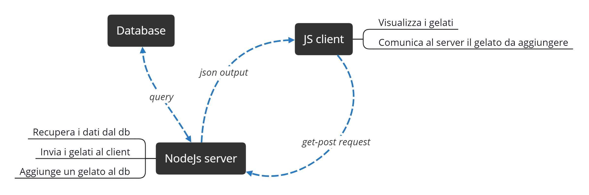

# Project Description

<h1 align="center">
  
</h1>

Lo scopo del progetto è realizzare un software che permetta da un client browser la modifica e la visualizzazione di un database remoto.

A livello tecnico verrà utilizzato NodeJs come server, il quale fornirà la pagina del client con cui comunicherà tramite AJAX e successivamente, con il database.

### Specifications

- **Database:** Deve contenere la tabella Gelato con i campi Id, Nome, Costo, Produttore.
- **Client:** Deve elencare i gelati presenti sul server e poterne aggiungere (facendo richiesta al server tramite get/post).
- **Server:** Deve restituire al server un JSON contenente i dati e aggiungere un gelato quando riceve una richiesta.